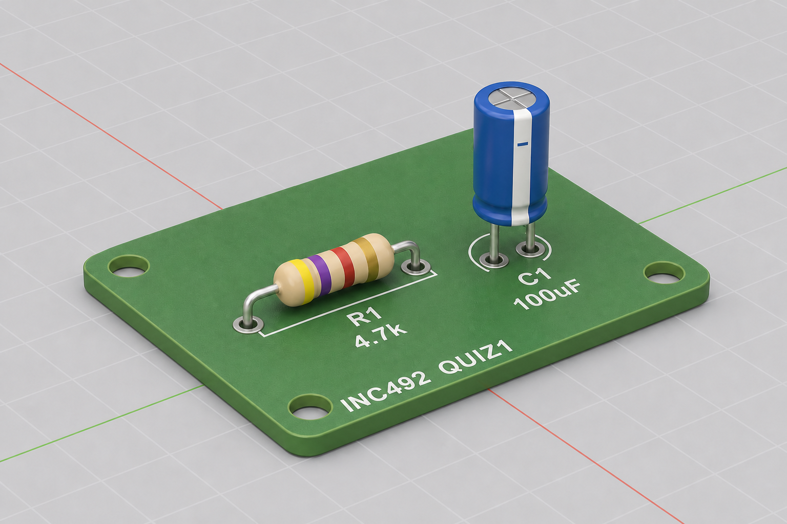

# ตัวอย่าง Quiz 1 — Blender: PCB + Resistor + Capacitor

- **วันที่:** 2 กันยายน 2026
- **เวลา:** 09:30–11:30
- **ห้อง:** CB40610
- **คะแนนเต็มของ Quiz 1:** **100 คะแนน**
- **น้ำหนักในวิชา:** **25%** ของคะแนนรวมทั้งรายวิชา
- **ซอฟต์แวร์:** Blender เวอร์ชั่นล่าสุด
- **หน่วย:** **Millimeters (mm)** ใน Blender (ตั้ง Scene Unit เป็น Metric → Length = Millimeters)
- **ไฟล์เริ่มต้น:** [`quiz1_template.blend`](quiz1_template.blend) **เท่านั้น**

---

## คะแนนย่อยแต่ละส่วน (รวม 100%)

| ส่วน | ชิ้นงาน                    | คะแนน % |
| ---- | -------------------------- | ------: |
| A    | PCB + holes                |      30 |
| B    | Resistor                   |      30 |
| C    | Capacitor                  |      25 |
| D    | Assembly + naming + ส่งงาน |      15 |
|      | **รวม**                    | **100** |

> [!NOTE]
> ได้กี่คะแนนจาก 100 ใน Quiz นี้ จะถูกนำไปคิดเป็น **25%** ของเกรดรายวิชา

> [!WARNING]
> **ในการสอบต้องเริ่มจากไฟล์เทมเพลตเท่านั้น**  
> เปิดและทำงานบน [`quiz1_template.blend`](quiz1_template.blend) **เท่านั้น**  
> สร้างโมเดลใหม่ทั้งหมดในไฟล์นี้ระหว่างเวลาสอบ  
> **ห้าม** เปิด / นำเข้า / ดัดแปลงโมเดลหรือไฟล์ `.blend` อื่นที่มีอยู่แล้ว  
> **ห้าม** ใช้ asset สำเร็จรูปจากภายนอก หรือ copy จากงานเก่า

---

## คำสั่ง

1. เปิดไฟล์เริ่มต้น [`quiz1_template.blend`](quiz1_template.blend) **เท่านั้น** (Save As เป็น `quiz1_<รหัสนักศึกษา>.blend` ก่อนเริ่มทำ)
2. ตรวจว่าหน่วยเป็น **Millimeters (mm)** แล้วทำงานด้วยตัวเลขหน่วย mm ตามสเปกโจทย์
3. สร้าง **assembly scene** ขนาดเล็ก ประกอบด้วย 3 ส่วน:

- **PCB** (มีรู mounting / pad และ **silkscreen**)
- **Resistor** (4-band, axial)
- **Electrolytic capacitor** (radial)

วาง resistor และ capacitor บน PCB ในตำแหน่ง pad ที่สมเหตุสมผล  
บน PCB ต้องมี silkscreen เช่น `R1` `4.7k` · `C1` `100uF` · `INC492 QUIZ1` (ตามภาพตัวอย่าง)

### ตัวอย่างผลลัพธ์สุดท้าย (conceptual)



> [!NOTE]
> ภาพนี้เป็น **ภาพจำลองแนวคิด** เพื่อช่วยเห็นภาพผลงานโดยรวมเท่านั้น ไม่ใช่คำตอบมาตรฐานที่ต้องทำตามทีละพิกเซล  
> สังเกต silkscreen บน PCB: `R1` `4.7k` · `C1` `100uF` · `INC492 QUIZ1`

---

## ส่วน A — PCB (30 คะแนน)

| รายการ                  | ค่า                           |
| ----------------------- | ----------------------------- |
| ขนาด board (L × W × T)  | **40.0 × 25.0 × 1.6 mm**      |
| สี board                | เขียว (matte หรือ semi-gloss) |
| มุมโค้ง (corner radius) | ไม่บังคับ (≤ 2 mm)            |
| Silkscreen (สีขาว)      | ดูตารางด้านล่าง               |

### Silkscreen บน PCB (บังคับ)

| ข้อความ        | ตำแหน่งแนวคิด             |
| -------------- | ------------------------- |
| `R1`           | ใกล้ resistor             |
| `4.7k`         | ใต้หรือข้าง `R1`          |
| `C1`           | ใกล้ capacitor            |
| `100uF`        | ใต้หรือข้าง `C1`          |
| `INC492 QUIZ1` | ขอบ board (เช่น ด้านล่าง) |

### รูที่ต้องเจาะ (drill ทะลุ board)

| กลุ่มรู        | จำนวน | Diameter   | วัตถุประสงค์              |
| -------------- | ----: | ---------- | ------------------------- |
| Mounting holes | **4** | **3.0 mm** | มุมละ 1 รู                |
| Resistor pads  | **2** | **1.0 mm** | สำหรับ lead ของ resistor  |
| Capacitor pads | **2** | **1.2 mm** | สำหรับ lead ของ capacitor |

**กฎการวางรู**

- Mounting holes: ระยะจากขอบ board ≥ 3 mm (วัดจาก center ของรูถึงขอบ)
- Resistor pads: ห่างกัน **10.0 mm** (center-to-center) วางบนเส้นกลางหรือแถวที่ชัดเจน
- Capacitor pads: ห่างกัน **5.0 mm** (center-to-center) วางตำแหน่งอื่นบน board (ห้ามทับ resistor pads)

**การตั้งชื่อ object (บังคับ)**

```text
Collection: PCB
├── PCB_Board
└── (แนะนำ: เจาะรูด้วย Boolean บน PCB_Board)
```

ถ้าเก็บตัวตัดรูเป็น object แยก ให้ตั้งชื่อ `PCB_Hole_*` แล้วซ่อนหลัง Apply Boolean

---

## ส่วน B — Resistor (30 คะแนน)

| รายการ                      | ค่า                                                  |
| --------------------------- | ---------------------------------------------------- |
| ค่าความต้านทาน              | **4.7 kΩ ± 5%**                                      |
| Color bands (ซ้าย → ขวา)    | **Yellow · Violet · Red · Gold**                     |
| ความยาว body (ไม่รวม leads) | **6.0 mm**                                           |
| Diameter ของ body           | **2.5 mm**                                           |
| Diameter ของ lead           | **0.8 mm**                                           |
| Orientation                 | **horizontal** · เสียบ leads เข้า resistor pad holes |

**Materials:** body + bands = glossy · leads = metallic

**Objects (บังคับ):** `R_Body`, `R_Band1`–`R_Band4`, `R_Lead_L`, `R_Lead_R`

---

## ส่วน C — Capacitor (25 คะแนน)

| รายการ                    | ค่า                                                  |
| ------------------------- | ---------------------------------------------------- |
| ประเภท                    | electrolytic · radial leads                          |
| ค่าความจุ                 | **100 µF**                                           |
| Diameter × ความสูงของ can | **8.0 × 12.0 mm**                                    |
| Diameter × ความยาว lead   | **0.6 × 5.0 mm** (×2)                                |
| เครื่องหมาย polarity      | มีแถบ **(−)** บน can ให้เห็นชัด                      |
| Orientation               | ตั้งตรงบน PCB · เสียบ leads เข้า capacitor pad holes |

**Materials:** can = น้ำเงินหรือดำ · ฝาด้านบนเข้มกว่า · leads = metallic

**Objects (บังคับ):** `C_Can`, `C_Top`, `C_MinusMark`, `C_Lead_Positive`, `C_Lead_Negative`

---

## กติกาการประกอบ — ส่วน D (15 คะแนน)

1. Resistor และ capacitor ต้องวางบน **หน้าบน (top face)** ของ PCB
2. Leads ต้อง **เสียบเข้า** pad holes ที่ตรงกัน (ยอมรับความคลาดเคลื่อน ±0.5 mm)
3. **Apply Scale** ทุก object ก่อนส่งงาน
4. เริ่มจาก [`quiz1_template.blend`](quiz1_template.blend) **เท่านั้น** — **ห้าม** นำโมเดล/ไฟล์อื่นมาดัดแปลง และห้ามใช้ asset จากภายนอก
5. ตั้งชื่อ object ตามที่กำหนดในส่วน A–C และจัดอยู่ใน collections ที่เหมาะสม

### ส่งงาน

1. **Capture ทั้งหน้าจอ (full-screen screenshot)** โดยให้เห็น:
   - โมเดลใน Blender ชัดเจน (PCB, resistor, capacitor, silkscreen)
   - **นาฬิกาของเครื่องคอมพิวเตอร์** (system clock บน taskbar / menu bar) ติดมาในภาพด้วย
2. บันทึกไฟล์รูปภาพเป็น `quiz1_<รหัสนักศึกษา>.png`
3. บันทึกไฟล์โปรเจกต์เป็น `quiz1_<รหัสนักศึกษา>.blend`
4. **ส่งทั้งไฟล์รูปภาพและไฟล์ `.blend` เข้าระบบ LEB2** ภายในเวลาที่กำหนด

| ไฟล์                         | รายละเอียด                                                |
| ---------------------------- | --------------------------------------------------------- |
| `quiz1_<รหัสนักศึกษา>.png`   | full-screen screenshot · เห็นโมเดลชัด + เห็นนาฬิกาเครื่อง |
| `quiz1_<รหัสนักศึกษา>.blend` | scene ทั้งหมด                                             |

> [!IMPORTANT]
> ต้องส่งครบ **2 ไฟล์** (`.png` + `.blend`)  
> Screenshot ต้องเป็น **ทั้งหน้าจอ** และต้องเห็น **นาฬิกาของเครื่อง** ในภาพ  
> โมเดลต้องมองเห็นรายละเอียดสำคัญได้ชัด ไม่เบลอ ไม่ถูกบังจนอ่าน silkscreen ไม่ได้

| หัวข้อตรวจในส่วน D            |  คะแนน |
| ----------------------------- | -----: |
| จัดวางเข้า pads / ไม่ลอย      |      6 |
| ตั้งชื่อ object + collections |      4 |
| Apply Scale ครบ               |      3 |
| ส่งไฟล์ครบ                    |      2 |
| **รวมส่วน D**                 | **15** |

---

## เกณฑ์ให้คะแนนรวม (100 คะแนน = 25% ของวิชา)

| ส่วน  | เน้นตรวจ                                                                     |   คะแนน |
| ----- | ---------------------------------------------------------------------------- | ------: |
| **A** | ขนาด PCB ±10% · holes · silkscreen (`R1`/`4.7k`/`C1`/`100uF`/`INC492 QUIZ1`) |      30 |
| **B** | ขนาด resistor · color bands ของ 4.7k ถูกต้อง · materials (glossy/metallic)   |      30 |
| **C** | ขนาด capacitor · มีแถบ (−) · leads เป็น metallic · วางตั้งตรง                |      25 |
| **D** | จัดวางเข้า pads · ตั้งชื่อ object · Apply Scale · ส่งไฟล์ครบ                 |      15 |
|       | **รวม**                                                                      | **100** |

### การหักคะแนนแบบรวดเร็ว

| ปัญหา                            | หัก                           |
| -------------------------------- | ----------------------------- |
| Diameter ของรูผิดเกิน 20%        | −5 ต่อกลุ่มรู                 |
| Color bands ลำดับหรือสีผิด       | −15 (ส่วน B)                  |
| ไม่มีแถบ (−) บน capacitor        | −8 (ส่วน C)                   |
| ชิ้นส่วนลอย / ไม่เสียบเข้า holes | −8 (ส่วน D)                   |
| รวม objects ที่ควรแยก            | −50% ของคะแนน naming ในส่วน D |
| ไม่ได้ Apply Scale               | −5 (ส่วน D)                   |

---

## เวลาแนะนำ (120 นาที)

| เวลา        | งาน                                        |
| ----------- | ------------------------------------------ |
| 09:30–09:40 | อ่านโจทย์ · ตรวจหน่วย **mm** · สร้าง collections |
| 09:40–10:20 | PCB + holes                                |
| 10:20–10:55 | Resistor                                   |
| 10:55–11:20 | Capacitor + assembly                       |
| 11:20–11:30 | ตรวจ naming / Apply Scale / ส่งงาน         |

---

> [!NOTE]
> **การเตรียมตัวสอบ (เบื้องต้น)**  
> ในวงจรอิเล็กทรอนิกส์ทั่วไปยังประกอบด้วย **IC**, **สายไฟ (wire)**, **LED**, **connector**, และ **switch** แบบต่าง ๆ  
> นักศึกษาควรฝึกโมเดลอุปกรณ์เหล่านี้ด้วย เพราะในโจทย์จริง **อาจเลือกใช้อุปกรณ์ที่หลากหลาย** ไม่จำกัดเฉพาะ PCB / resistor / capacitor ตามตัวอย่างด้านล่าง

> [!TIP]
> **ฝึกซ้อมเป็นพิเศษ — Modifier**  
> เพื่อช่วยเพิ่มประสิทธิภาพในการทำงาน แนะนำให้ฝึกใช้ modifier ดังนี้ก่อนสอบ:
>
> - **Boolean modifier** — เจาะรู PCB, ตัดชิ้นงาน
> - **Array modifier** — ทำชิ้นส่วนซ้ำ เช่น pads, leads, แถบสี
> - **Modifier แบบต่าง ๆ** — เช่น Bevel, Solidify, Mirror, Screw ตามความเหมาะสมของชิ้นงาน
>
> การคุ้นเคยกับ modifier จะช่วยให้สร้างโมเดลได้เร็วและเป็นระเบียบขึ้นในเวลาสอบ

---

## Checklist — พร้อมสอบหรือยัง?

ใช้รายการนี้ **verify ตัวเอง** ก่อนวันสอบ หากยังติ๊กไม่ได้ในข้อใด ให้ฝึกเพิ่ม

### พื้นฐาน Blender

- [ ] ติดตั้ง Blender แล้ว และเปิดใช้งานได้
- [ ] ได้เรียนรู้จากวิดีโอ Blender playlist **ครบทุกขั้นตอน** และทำตามได้แล้วทุกขั้นตอน
- [ ] ทดลองเปิด [`quiz1_template.blend`](quiz1_template.blend) ได้ และรู้ว่าวันสอบต้องใช้ไฟล์นี้เป็นจุดเริ่มต้นเท่านั้น
- [ ] ใช้ viewport (orbit / pan / zoom) และ Object / Edit Mode ได้คล่อง
- [ ] ตั้งชื่อ object และจัด collections ได้
- [ ] ตั้งและสลับ units ได้ (meters / centimeters / millimeters) และรู้ว่า**วันสอบใช้ Millimeters (mm)**
- [ ] ใส่ขนาดชิ้นงานเป็นตัวเลขหน่วย **mm** ตามสเปกได้ (เช่น body ยาว 6.0 mm)
- [ ] **Apply Scale** ได้ทุก object

### Modifier และเทคนิคเร่งงาน

- [ ] ใช้ **Boolean modifier** เจาะรูได้
- [ ] ใช้ **Array modifier** ได้
- [ ] ใช้ modifier อื่น ๆ ที่จำเป็นได้ (เช่น Bevel, Solidify, Mirror)

### ชิ้นงานตามตัวอย่างโจทย์

- [ ] สร้าง **PCB** พร้อม mounting holes และ pad holes ได้
- [ ] ใส่ **silkscreen** บน PCB ได้ (`R1` / `4.7k` / `C1` / `100uF` / `INC492 QUIZ1`)
- [ ] สร้าง **resistor** 4-band พร้อม color code ได้
- [ ] สร้าง **electrolytic capacitor** พร้อมแถบ (−) ได้
- [ ] ตั้งค่า **material** ได้ — เปลี่ยนสี (Base Color) และปรับคุณสมบัติต่าง ๆ เช่น Metallic, Roughness, glossy / matte
- [ ] แยก material ตามชิ้นส่วนได้ (เช่น body, bands, leads, PCB, silkscreen)
- [ ] ประกอบชิ้นส่วนบน PCB ให้ leads เสียบเข้า pads ได้

### อุปกรณ์เสริมที่ควรฝึกเพิ่ม

- [ ] ฝึกสร้างโมเดล **IC**, **wire**, **LED**, **connector**, **switch** อย่างน้อยแบบง่าย

### การส่งงาน

- [ ] รู้วิธีบันทึกไฟล์ `.blend`
- [ ] รู้วิธี **capture ทั้งหน้าจอ** ให้เห็นโมเดลชัดและเห็น **นาฬิกาเครื่อง**
- [ ] รู้ช่องทางส่งงาน (**LEB2**) และต้องส่งครบ `.png` + `.blend`

> [!IMPORTANT]
> ถ้ายังติ๊กไม่ได้หลายข้อ ให้ฝึกซ้ำจาก playlist Blender และลองทำตัวอย่างโจทย์นี้ให้จบ 2-3 รอบก่อนวันสอบ
